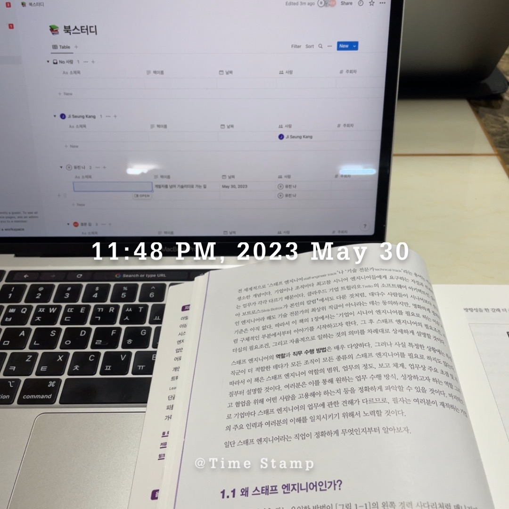

# 이 책을 선택한 이유

앞으로 어떤 개발자가 되고 싶은지? 어떤 사람이 되고 싶은지? 요새 내가 하고 있는 고민이다.
최근 좋은 기회로 신입 프론트엔드 개발자 채용에 함께 할 수 있었다.
이력서 검토부터 면접을 넘어 현재는 신입 개발자가 입사하여 온보딩 업무까지 진행하고 있다.
입사한 지 얼마 되지 않은 나에게 너무나도 과분하면서도 오히려 내가 더 많이 배우고, 생각하는 시간을 보내고 있다.

온보딩을 진행하면서, 어떻게 온보딩을 진행할지, 어디까지 안내해야할지, 어떻게 안내해야할지, 질문에 대한 답변은 어떤식으로 하면 좋을지. 매일매일이 고민이다.

이 책을 내가 선택한 이유는 언젠가 나는 계속해서 성장하여 리더가 되고 싶다는 생각을 가지고 있기 때문이다. 그렇다면 리더는 어떤 사고를 가지고 있고, 어떻게 준비해 나가면 좋은지에 대해서 가이드를 받고 싶어 선택하게 되었다.

---

