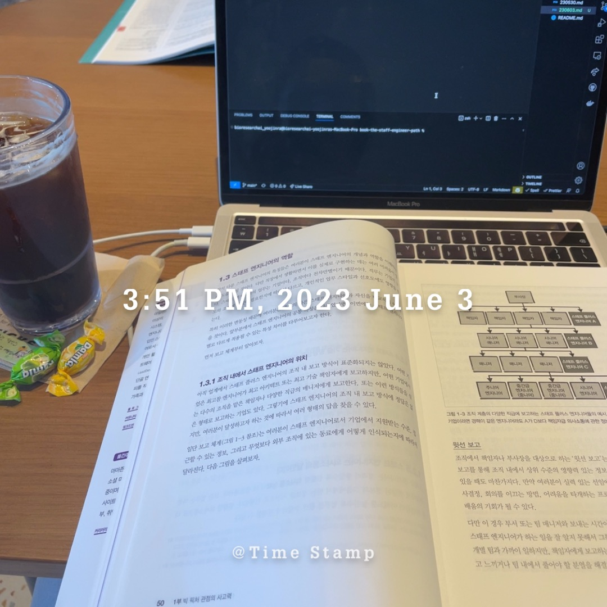

# 스태프 엔지니어란?

- 리더 역할을 맡는다.
- 우수한 엔지니어링을 잘 알아야 한다.
- 시간을 잘 관리하여야 한다.
- 올바른 기술 방향성을 설정한다.
- 원활한 의사소통을 잘해야한다.
- 스태프 엔지니어는 적어도 본인의 업무 범위 내에서 만큼은 단기 및 장기 목표에 영향력을 행사하며 주요한 의사결정이 무엇인지 알아야 한다.

이 책에서는 스태프 엔지니어 직급에 대해 무엇인지, 어떤 역할을 하는 지 설명한다.

이제 6개월이 조금 넘은 주니어 개발자에게는 아주 먼 직급의 이야기이기 때문에 중요하지 않을 수 있다. 하지만, 내가 이 책을 계속 읽어 나가면서 스태프 엔지니어에 대해서 이해하려고 하는 이유는 향후 어떤 개발자가 될지에 대해 미리 생각해보면서 목표를 설정해보기 위해서이다.

어떤 생각을 가지고, 삶을 살아가는 지에 따라서 인생이 달라질 수 있다고 생각하기 때문이다.

이 책의 Chapter 1을 마무리 지으며, 나에게 있어서 부족함을 어떻게 채울지에 대해서 앞으로의 나의 과제가 될 것 같다.

- 리더 역할을 맡는다. : 현명한 리더가 되고 싶다는 생각을 예전부터 해왔었는데, 어떤 행동을 해야하는 지에 대해서는 고민해볼 사항 같다.
- 우수한 엔지니어링을 잘 알아야 한다. : 이 부분에 대해서는 계속해서 기술적인 공부를 진행해야 할 것 같다. 업무를 진행하면서 잘 알지 못하고 있는 부분에 대해서 업무후에 찾아서 계속해서 채워가야 할 것같다. 다시 til을 작성하기 시작해야 갰다.
- 시간을 잘 관리하여야 한다. : 정해진 시간안에 정해진 프로젝트를 완료하는 것. 굉장히 중요하다고 요새 많이 느끼게 되었다. 처음 계획 부터 어떤 상황이 벌어질 지에 대해서 구체적으로 적어보면서 일정을 세우는 연습을 해봐야 겠다. 그리고 추가적인 이슈가 생긴다면, 어떻게 해결하고 어떻게 마무리할지에 대해서 기록하는 습관을 가져봐야 겠다.
- 올바른 기술 방향성을 설정한다. : 이 부분에 대해서는 아직 어떻게 채워야 할지 잘 모르겠다. 직접 경험 + 간접경험을 통해 경험이 쌓여야 할것 같다.
- 원활한 의사소통을 잘 해야한다. : 개발자로 일하며, 의사소통은 굉장히 중요하다고 느낀다. 특히 타 부서와 협의해야할 사항이 많기 때문에 모두가 기분 좋게, 근거를 가지고 이야기 하는 것을 의식하며 말하는 습관을 가져야 할것 같다.

---

