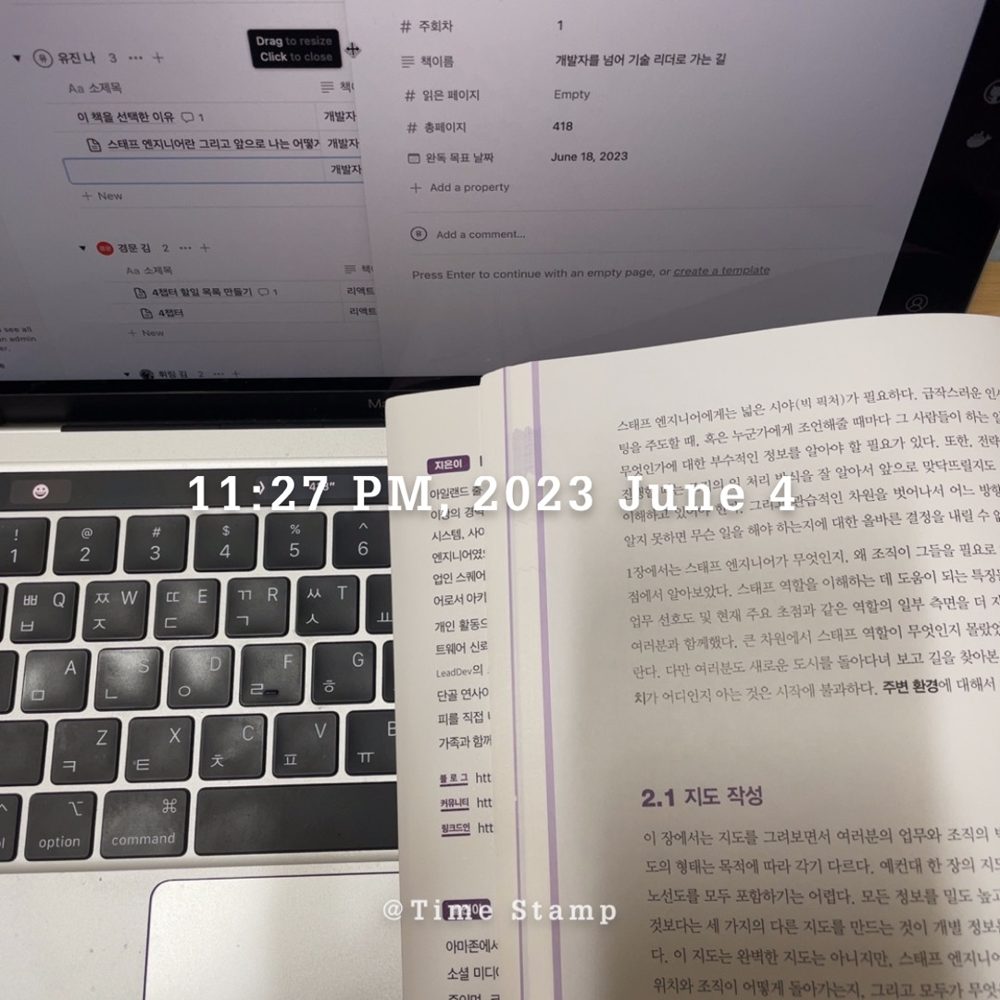

# 빅 픽처를 보는 방법...

경력이 쌓일수록, _진정한 영향력을 행사한다는 것_ 은 자신의 업무를 좀 더 큰 맥락에 기반해서 파악하고, 여러분이 처한 위치에 따라 여러분의 관점이 큰 영향을 받는 것을 의미한다.

### 빅 픽처를 보는 방법

- 외부 관점에서 보기
- (모두가 같은 의견을 가진) 반향실에서 빠져나오기
- 중요도 설정하기
  - 중요도나 목표는 상황이나 시간에 따라서 계속 변화하다. 시간에 따라 프로젝트의 중요도는 바뀌므로, 현시점에서 무엇이 중요한지 파악해보자.
  - 기업의 목표는 명시된 목표와 측정 기준을 넘어서서 계속해서 확장된다.
    `→ 업무를 진행하면서 현재 제일 중요한 일이 무엇인지. 우선순위가 어떻게 되는지 주기적으로 체크하는 습관을 가져야 할 것 같다.`
- 고객의 욕구 파악하기
- 기존 해결책 분석하기

해당 부분에 대해서 아직 생각 정리가 제대로 되지 않았다. 다시 읽어봐야할것 같다.

---

